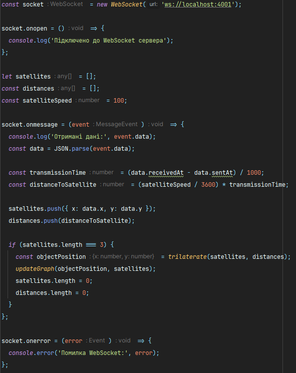

## GPS Lab
Емулятор вимірювальної частини GPS надається у вигляді Docker image під назвою iperekrestov/university/gps-emulation-service. Щоб запустити емулятор, виконайте наступні кроки:
1. Завантажте Docker image з Docker Hub:  
   ````
   docker pull iperekrestov/university:gps-emulation-service
   ````
2. Запустіть Docker контейнер, використовуючи наступну команду:  
   ````
   docker run --name gps-emulator -p 4001:4000 iperekrestov/university:gps-emulation-service
   ````

Застосунок підключається до WebSocket сервера і зчитує дані про положення супутників і об'єкта, відображає дані та положення супутників і об'єкта на графіку за допомогою бібліотеки Plotly.  




До властивості socket.onmessage додаємо колбек функцію, яка обробляє повідомлення від сервера. Вона отримує дані про супутники, розраховує затримку сигналу і відстань до об'єкта, а потім обчислює його положення (якщо є три супутники) та викликає функцію для оновлення графіку.


Функція trilaterate використовує координати супутників і відстані для обчислення координат об'єкта за допомогою методу трилатерації.


Функція updateGraph малює супутники і об'єкт на графіку за допомогою бібліотеки Plotly. Маркери для супутників і об'єкта відображаються різними кольорами, і графік оновлюється щоразу після отримання нових даних.

У застосунку можна змінювати параметри вимірювальної частини GPS.

